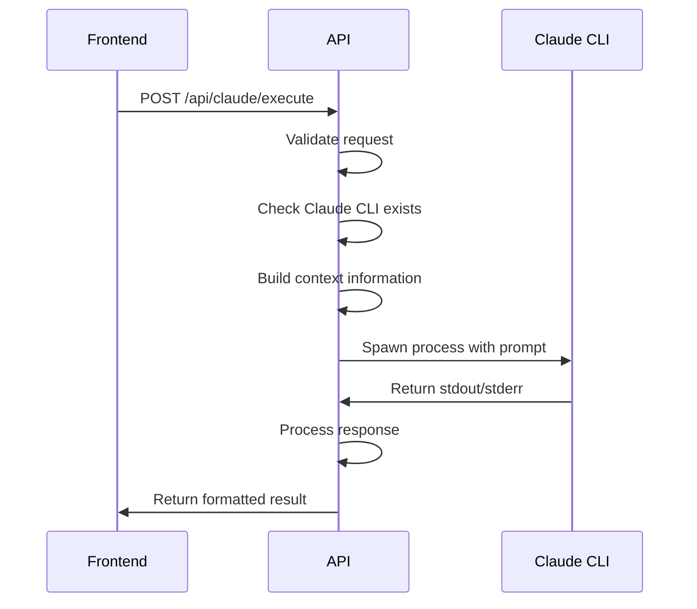

# Chatbot API Reference

Complete API documentation for the Claude CLI chatbot integration.

## Endpoints

### Health Check
**GET** `/api/claude/execute`

Returns the current status and configuration of the Claude CLI integration.

#### Response
```json
{
  "status": "healthy",
  "service": "claude-execute", 
  "timestamp": "2025-07-02T20:50:41.052Z",
  "claudeCliPath": "/Users/derakhshani/.claude/local/claude",
  "claudeCliExists": true,
  "timeout": 30000,
  "projectRoot": "/Users/derakhshani/Documents/GitHub/AVI-Tech/ava"
}
```

### Execute Command
**POST** `/api/claude/execute`

Executes a Claude CLI command with the provided prompt and context.

#### Request Body
```typescript
interface ExecuteRequest {
  prompt: string;                    // Required: User's prompt/command
  context?: {
    pageId?: string;                 // Current page identifier
    currentPage?: string;            // Current page URL path
    timestamp?: string;              // Request timestamp
  };
}
```

#### Example Request
```json
{
  "prompt": "What is your current working directory?",
  "context": {
    "pageId": "playground",
    "currentPage": "/playground",
    "timestamp": "2025-07-02T20:50:41.052Z"
  }
}
```

#### Response
```typescript
interface ExecuteResponse {
  success: boolean;
  result?: string;                   // Claude CLI output (if successful)
  error?: string;                    // Error message (if failed)
  executionId?: string;              // Unique execution identifier
}
```

#### Success Response Example
```json
{
  "success": true,
  "result": "/Users/derakhshani/Documents/GitHub/AVI-Tech/ava",
  "executionId": "1751489705906"
}
```

#### Error Response Example
```json
{
  "success": false,
  "error": "Claude CLI not found at /usr/local/bin/claude. Please check installation or set CLAUDE_CLI_PATH environment variable."
}
```

## Request/Response Flow



## Context Building

The API automatically enhances user prompts with project context:

```
=== CONTEXT INFORMATION ===
Project: AVA System (Next.js 14 with TypeScript)
Working Directory: /Users/derakhshani/Documents/GitHub/AVI-Tech/ava
Current Time: 2025-07-02T20:50:41.052Z
Page ID: playground
Current Page: /playground

Available Tools: Read, LS, Glob, Grep, Write, Edit, MultiEdit, Bash
Project Structure: Page-centric Next.js app with component registry
=== END CONTEXT ===

User Request: {user_prompt}
```

## Error Handling

### Validation Errors (400)
- Missing or invalid prompt
- Invalid request format

### Server Errors (500)
- Claude CLI not found
- Process execution failures
- Timeout errors
- System errors

### Error Response Format
All error responses follow this structure:
```json
{
  "success": false,
  "error": "Descriptive error message"
}
```

## Environment Configuration

| Variable | Default | Description |
|----------|---------|-------------|
| `CLAUDE_CLI_PATH` | Auto-detected | Full path to Claude CLI executable |
| `CLAUDE_EXECUTION_TIMEOUT` | `300000` | Timeout in milliseconds (5 minutes) |

## Process Management

### Timeout Handling
- Default timeout: 5 minutes (300 seconds)
- Graceful termination with SIGTERM
- Force kill with SIGKILL after 2 seconds
- Proper cleanup of processes and resources

### Logging
The API provides detailed logging for debugging:

```javascript
console.log(`[${executionId}] Starting Claude CLI execution with args:`, args);
console.log(`[${executionId}] stdout:`, chunk.substring(0, 100) + '...');
console.log(`[${executionId}] Process exited with code ${code}`);
```

### Security Considerations

1. **Input Sanitization**: All prompts are validated before execution
2. **Process Isolation**: Each command runs in a separate process
3. **Resource Limits**: Timeout and process cleanup prevent resource exhaustion
4. **Working Directory**: Commands are restricted to the project directory
5. **Tool Restrictions**: Only safe tools are available to Claude CLI

## Testing Examples

### cURL Examples

```bash
# Health check
curl -X GET http://localhost:3000/api/claude/execute

# Simple command
curl -X POST http://localhost:3000/api/claude/execute \
  -H "Content-Type: application/json" \
  -d '{"prompt": "What is your current working directory?"}'

# Command with context
curl -X POST http://localhost:3000/api/claude/execute \
  -H "Content-Type: application/json" \
  -d '{
    "prompt": "List the files in the src directory",
    "context": {
      "pageId": "playground",
      "currentPage": "/playground"
    }
  }'

# File operation
curl -X POST http://localhost:3000/api/claude/execute \
  -H "Content-Type: application/json" \
  -d '{"prompt": "Read the package.json file and tell me about the dependencies"}'
```

### JavaScript/TypeScript Examples

```typescript
// Simple execution
const response = await fetch('/api/claude/execute', {
  method: 'POST',
  headers: {
    'Content-Type': 'application/json',
  },
  body: JSON.stringify({
    prompt: 'What is your current working directory?',
    context: {
      pageId: 'playground',
      currentPage: window.location.pathname,
      timestamp: new Date().toISOString()
    }
  }),
});

const data = await response.json();
if (data.success) {
  console.log('Result:', data.result);
} else {
  console.error('Error:', data.error);
}
```

## Rate Limiting

Currently, there are no explicit rate limits, but the following natural limits apply:
- **Concurrent Executions**: Limited by system resources
- **Timeout**: 30 seconds per request
- **Process Cleanup**: Automatic cleanup prevents resource exhaustion

## Performance Considerations

### Typical Response Times
- Simple commands (pwd, ls): 1-3 seconds
- File operations (read, write): 2-5 seconds  
- Complex operations (analysis): 5-30 seconds

### Optimization Tips
1. Use specific, focused prompts
2. Avoid overly complex multi-step operations
3. Break large tasks into smaller requests
4. Monitor execution logs for performance insights

## Future API Enhancements

### Planned Features
- **Streaming Responses**: Real-time output streaming via WebSocket
- **Batch Operations**: Multiple commands in a single request
- **Session Management**: Persistent conversation sessions
- **File Upload**: Direct file upload and processing
- **Custom Tools**: Page-specific tool restrictions

### Breaking Changes
None planned. The current API is designed to be stable and backward-compatible.