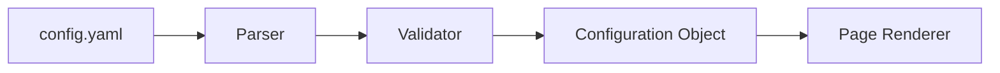

# Configuration System Architecture

## Overview

The Dashboard page configuration system is a powerful, YAML-based architecture that enables AI agents to completely control page structure, appearance, and functionality without modifying source code. This document provides a comprehensive understanding of the configuration system architecture and its capabilities.

## 🎯 Purpose and Goals

The configuration system serves as the primary interface for AI agents to:

1. **Define Page Structure** - Control layout, component placement, and hierarchy
2. **Configure Components** - Set properties, behavior, and data bindings
3. **Manage Data Sources** - Define database queries and refresh intervals
4. **Control Navigation** - Configure sidebar, header, and breadcrumbs
5. **Track Metadata** - Version control and page information

## 🏗️ Architecture Overview

```yaml
# Configuration Architecture Diagram
┌─────────────────────────────────────────────────────────────┐
│                    config.yaml                              │
├─────────────────────────────────────────────────────────────┤
│  ┌──────────────┐  ┌──────────────┐  ┌──────────────┐     │
│  │     page     │  │    layout    │  │  components  │     │
│  │   metadata   │  │    system    │  │    array     │     │
│  └──────────────┘  └──────────────┘  └──────────────┘     │
│                                                             │
│  ┌──────────────┐  ┌──────────────┐  ┌──────────────┐     │
│  │     data     │  │  navigation  │  │     meta     │     │
│  │   sources    │  │   settings   │  │  information │     │
│  └──────────────┘  └──────────────┘  └──────────────┘     │
└─────────────────────────────────────────────────────────────┘
                              │
                              ▼
                    ┌──────────────────┐
                    │  Configuration   │
                    │     Parser       │
                    └──────────────────┘
                              │
                              ▼
                    ┌──────────────────┐
                    │    Validated     │
                    │  Configuration   │
                    └──────────────────┘
                              │
                              ▼
                    ┌──────────────────┐
                    │  Page Renderer   │
                    └──────────────────┘
```

## 📋 Configuration Structure

### Root Level Structure

```yaml
# Complete configuration structure
page:            # Page metadata and routing
layout:          # Layout system configuration
components:      # Component definitions array
data:            # Data source definitions
navigation:      # Navigation settings
meta:            # Document metadata
```

### Configuration Sections

#### 1. Page Section
Defines core page properties and routing information.

```yaml
page:
  title: string         # Page title displayed in browser tab
  route: string         # URL route (e.g., "/" for dashboard)
  description: string   # Page description for documentation
```

#### 2. Layout Section
Controls the grid-based layout system for component positioning.

```yaml
layout:
  type: "grid"         # Layout type (currently only "grid" supported)
  columns: number      # Number of grid columns (default: 12)
  gap: number          # Gap between components in pixels
  padding: number      # Page padding in pixels
```

#### 3. Components Section
Array of component definitions with positioning and properties.

```yaml
components:
  - id: string                # Unique component identifier
    type: string              # Component type (must match registered component)
    position:                 # Grid positioning
      col: number            # Starting column (1-based)
      row: number            # Starting row (1-based)
      span: number           # Column span width
      rowSpan?: number       # Optional row span height
    props: object            # Component-specific properties
    className?: string       # Optional CSS class names
    style?: object          # Optional inline styles
```

#### 4. Data Section
Defines data sources for dynamic content.

```yaml
data:
  sources:
    - name: string           # Data source identifier
      type: string           # Source type (e.g., "supabase", "api")
      query: string          # Query or endpoint
      refresh: string        # Refresh interval (e.g., "30s", "1m")
      transform?: object     # Optional data transformation
```

#### 5. Navigation Section
Controls page navigation elements.

```yaml
navigation:
  showSidebar: boolean       # Display sidebar navigation
  customHeader: boolean      # Use custom header component
  breadcrumbs: boolean       # Show breadcrumb navigation
```

#### 6. Meta Section
Metadata for version control and documentation.

```yaml
meta:
  author: string            # Page author/team
  version: string           # Configuration version
  lastModified: string      # Last modification date
  tags: string[]           # Categorization tags
```

## 🔧 Configuration Processing

### 1. Loading Process

```typescript
// Configuration loading sequence
1. Read config.yaml from page directory
2. Parse YAML to JavaScript object
3. Validate against schema
4. Apply defaults for missing values
5. Resolve component references
6. Initialize data sources
7. Render page with configuration
```

### 2. Validation Rules

The configuration system enforces strict validation:

- **Required Fields**: page.title, page.route, layout.type
- **Type Validation**: All fields must match expected types
- **Range Validation**: Grid positions must be within bounds
- **Component Validation**: Component types must be registered
- **Data Source Validation**: Source types must be supported

### 3. Default Values

```yaml
# Applied when not specified
layout:
  type: "grid"
  columns: 12
  gap: 4
  padding: 4

navigation:
  showSidebar: true
  customHeader: false
  breadcrumbs: true
```

## 🚀 Agent Usage Patterns

### Adding a New Component

```yaml
# Example: Adding a new stats card
components:
  # ... existing components ...
  
  - id: "new-stats-card"
    type: "StatsCard"
    position:
      col: 1
      row: 5
      span: 6
    props:
      title: "New Metric"
      value: 0
      trend: "up"
```

### Modifying Layout

```yaml
# Example: Changing to a denser layout
layout:
  type: "grid"
  columns: 24        # More columns for finer control
  gap: 2            # Smaller gap
  padding: 4        # Maintain padding
```

### Adding Data Sources

```yaml
# Example: Adding a new API data source
data:
  sources:
    - name: "analytics"
      type: "api"
      query: "/api/analytics/summary"
      refresh: "5m"
      transform:
        map: "data.metrics"
```

## 🔐 Safety and Validation

### Configuration Validation

All configuration changes go through multi-layer validation:

1. **YAML Syntax Validation** - Ensures valid YAML format
2. **Schema Validation** - Checks against TypeScript interfaces
3. **Business Logic Validation** - Ensures logical consistency
4. **Component Validation** - Verifies component compatibility
5. **Data Source Validation** - Confirms data source availability

### Error Handling

```yaml
# Example validation errors
Error: Component type "InvalidComponent" not found in registry
Error: Grid position col: 13 exceeds maximum columns: 12
Error: Data source type "unknown" is not supported
```

### Backup System

All configuration modifications create automatic backups:

```bash
.backups/
├── config_backup_2025-07-01T10-30-00-000Z.yaml
├── config_backup_2025-07-01T11-00-00-000Z.yaml
└── config_backup_2025-07-01T11-30-00-000Z.yaml
```

## 🔄 Configuration Lifecycle

### 1. Initial Load


### 2. Runtime Updates


### 3. Data Refresh


## 📚 Related Documentation

- [Layout Configuration](./layout-config.md) - Detailed layout system guide
- [Component Configuration](./component-config.md) - Component property reference
- [Data Configuration](./data-config.md) - Data source configuration
- [Theme Configuration](./theme-config.md) - Styling and theming

## 🎯 Best Practices

### 1. Component Organization
- Group related components by row
- Use consistent spacing patterns
- Plan for responsive behavior

### 2. Data Management
- Use appropriate refresh intervals
- Cache data when possible
- Handle loading and error states

### 3. Version Control
- Update version on significant changes
- Document changes in meta section
- Use semantic versioning

### 4. Performance
- Limit number of data sources
- Optimize refresh intervals
- Use efficient queries

## 🚨 Common Issues

### Grid Overflow
```yaml
# Problem: Component exceeds grid bounds
position:
  col: 10
  span: 4    # Extends to column 14 (exceeds 12)

# Solution: Adjust position or span
position:
  col: 9
  span: 4    # Now fits within 12 columns
```

### Missing Component Type
```yaml
# Problem: Component type not registered
type: "CustomWidget"  # Not in component registry

# Solution: Use registered component or create new one
type: "KPICards"      # Registered component
```

### Invalid Data Source
```yaml
# Problem: Unsupported data source type
type: "mongodb"       # Not implemented

# Solution: Use supported type
type: "supabase"      # Supported
```

## 🔧 Troubleshooting

### Configuration Not Loading
1. Check YAML syntax with online validator
2. Verify file path is correct
3. Check for syntax errors in console
4. Validate against schema

### Components Not Rendering
1. Verify component type is registered
2. Check position values are valid
3. Ensure props match component requirements
4. Check browser console for errors

### Data Not Updating
1. Verify data source configuration
2. Check network requests
3. Validate refresh interval format
4. Check data transformation logic

## 📝 Summary

The configuration system provides a powerful, safe interface for AI agents to fully control the Dashboard page. By understanding this architecture, agents can:

- Modify page layout and structure
- Add and configure components
- Integrate data sources
- Customize navigation
- Track changes with metadata

The system's validation layers and backup mechanisms ensure safe modifications while the YAML format keeps configuration human-readable and agent-friendly.

---

*Configuration System Architecture Documentation - Version 1.0*  
*Last Updated: 2025-07-01*